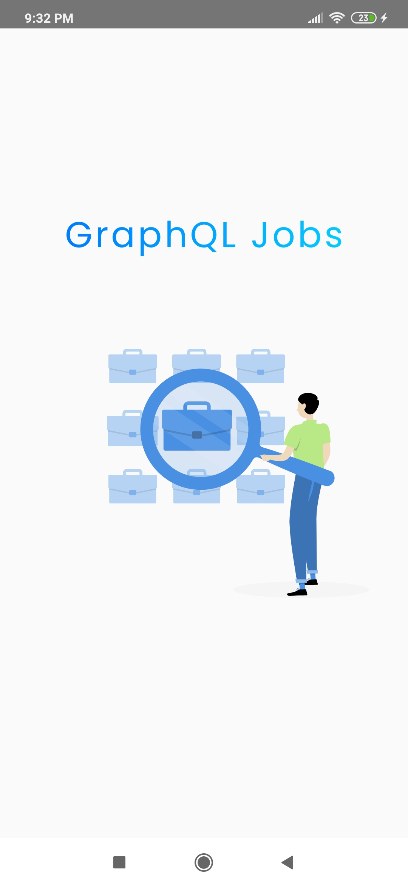
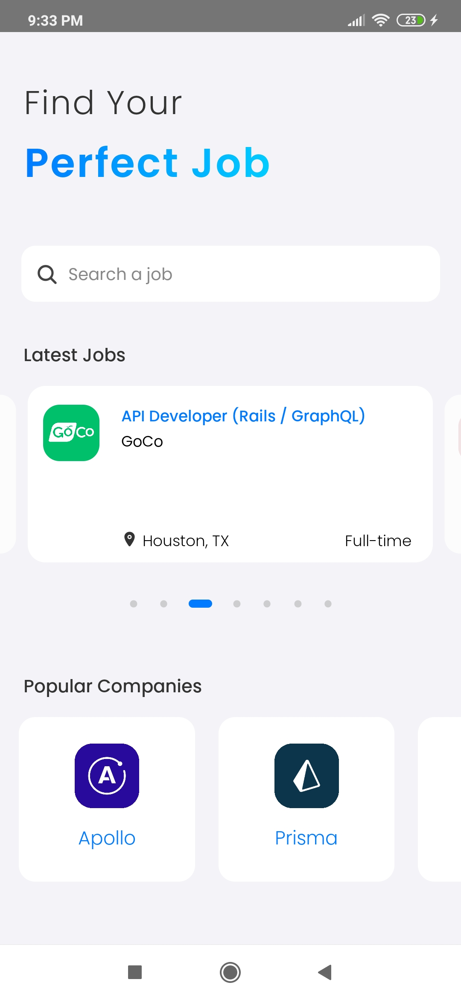
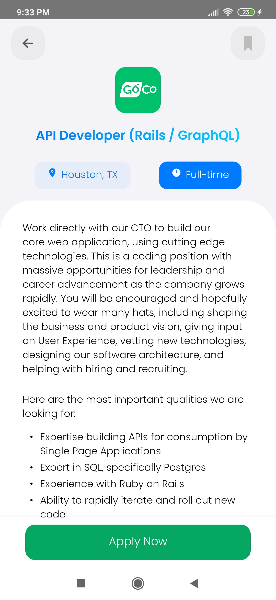
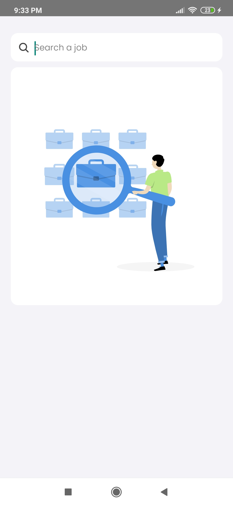
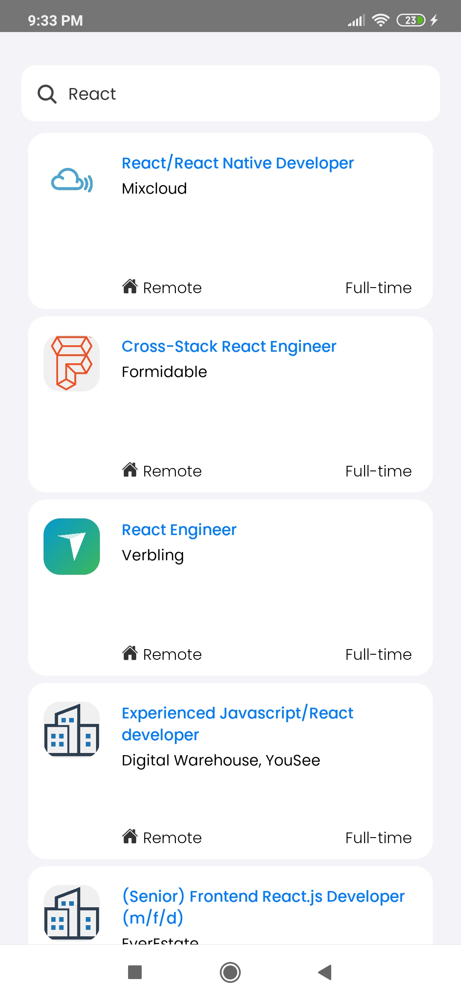
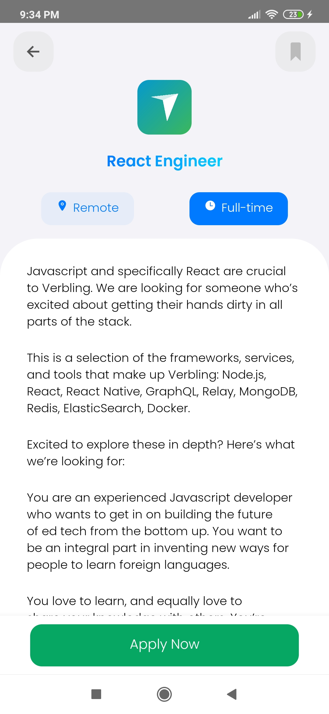

# GraphQL Jobs - Mobile App built with React Native

This application focuses on offering job offers related to development with GraphQL. The GraphQL API used is [GraphQL Jobs](https://api.graphql.jobs/), which is a public API.
I'm using [Apollo Client](https://www.npmjs.com/package/@apollo/client) as a GraphQL client to facilitate data fetching apart from the advantages that apollo hooks provide.

## Installation

* Clone the repo:
  `git clone https://github.com/LaurenceM10/graphql-jobs.git`

* Access the directory:
  `cd graphql-jobs`

* Install the dependencies:
  `yarn` or `npm install`

* Create a `.env` file in the root of the project with the following variable: `API_URL='https://api.graphql.jobs/'`

## Run

* `yarn run android`

Or to generate and run a release build: 
* `npx react-native run-android --variant release` 

This will compile JavaScript to bytecode during build time using [Hermes](https://hermesengine.dev/) which will improve app startup

Here are some screens of what the app looks like:

